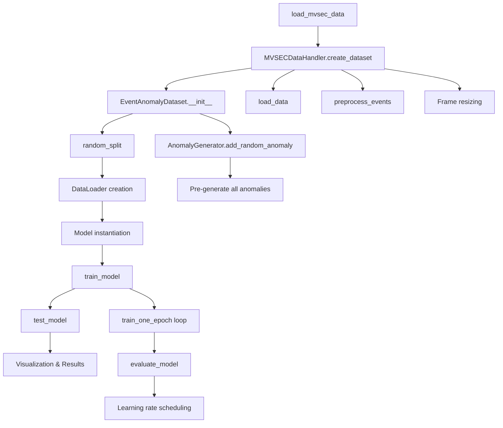

# Code Structure Documentation

## 📁 **File Organization**

```
kth/anomly-detection/
├── anomaly_detection.ipynb              # Main notebook implementation
├── MVSEC_Anomaly_Detection_Documentation.md  # Comprehensive documentation
├── Code_Structure_Documentation.md      # This file
├── system_architecture_diagram.py       # Diagram generation script
├── data/                               # MVSEC dataset directory
│   ├── indoor_flying2_data-002.hdf5   # Event data files
│   ├── indoor_flying3_data-003.hdf5
│   ├── outdoor_day1_data-008.hdf5
│   └── ...                            # Additional MVSEC files
└── output/                            # Generated visualizations
    ├── system_architecture.png
    ├── data_flow_diagram.png
    ├── model_architectures.png
    ├── anomaly_strategy.png
    └── evaluation_framework.png
```

## 🔧 **Notebook Cell Structure**

### **Cell Organization Hierarchy**

```
anomaly_detection.ipynb
├── 📖 [1] Project Overview & Documentation
├── 🔧 [2] Environment Setup & Imports
├── 💾 [3] Data Loading Configuration
├── 🔄 [4] Data Pipeline Documentation
├── 📥 [5] MVSEC Data Loading Functions
├── 🏗️ [6] Data Handler Class Implementation
├── 🎭 [7] Anomaly Generation Documentation
├── 🎲 [8] Anomaly Generator Implementation
├── 📦 [9] Dataset Creation Class
├── 🧠 [10] Neural Architecture Documentation
├── ⚡ [11] Spiking Neural Network Implementation
├── 🔄 [12] RNN & TCN Implementation
├── 🏋️ [13] Training & Evaluation Framework
├── 📊 [14] Visualization Functions
├── 🔗 [15] Complete Pipeline Function
├── 🚀 [16] Main Execution Pipeline
├── 🧪 [17] Data Loading Test
└── 📋 [18] Results & Conclusion
```

## 🏗️ **Class Architecture**

### **Core Classes Hierarchy**

```
Data Processing Layer:
├── MVSECDataHandler
│   ├── __init__(data_path, sequence, camera, sensor_size)
│   ├── load_data(max_events) → events_dict
│   ├── preprocess_events(events, num_frames) → frame_tensor
│   └── create_dataset(num_frames, frame_size) → processed_frames

Anomaly Generation Layer:
├── AnomalyGenerator
│   ├── __init__(seed)
│   ├── add_blackout_region(frame, region_size, intensity)
│   ├── add_vibration_noise(frame, region_size, intensity)
│   ├── flip_polarities(frame, region_size, flip_prob)
│   └── add_random_anomaly(frame, anomaly_type)

Dataset Layer:
├── EventAnomalyDataset(Dataset)
│   ├── __init__(frames, anomaly_ratio, transform)
│   ├── __len__() → int
│   ├── __getitem__(idx) → (frame, label, mask, anomaly_type)
│   └── [Pre-generated anomaly storage for efficiency]

Model Layer:
├── SpikingAnomalyDetector(nn.Module)
│   ├── SpikingConv2d layers (3x)
│   ├── Global average pooling
│   ├── Linear classification head
│   └── reset_membrane_potentials()
│
├── RNNAnomalyDetector(nn.Module)
│   ├── Conv2d feature extraction (2x)
│   ├── GRU temporal processing
│   └── Linear classification head
│
└── TCNAnomalyDetector(nn.Module)
    ├── TemporalBlock layers (3x)
    ├── Global average pooling
    └── Linear classification head
```

## 🔄 **Function Flow Diagram**

### **Main Pipeline Execution Flow**



## 📊 **Data Flow Architecture**

### **Data Transformation Pipeline**

```
Raw MVSEC HDF5 Files
└── Format: davis/left/events → [x, y, timestamp, polarity] arrays

Event Dictionary Extraction
└── Structure: {'x': array, 'y': array, 't': array, 'p': array}

Temporal Binning Process
├── Time range division: t_min → t_max / num_frames
├── Spatial mapping: (x,y) coordinates → pixel locations
├── Channel separation: polarity (+1/-1) → channels (0/1)
└── Normalization: raw counts → [0, 1] intensity range

Frame Tensor Generation
└── Output shape: (num_frames, 2, height, width)
    ├── Dimension 0: Temporal sequence (50 frames)
    ├── Dimension 1: Polarity channels (pos/neg events)
    ├── Dimension 2: Spatial height (64 pixels)
    └── Dimension 3: Spatial width (64 pixels)

Anomaly Injection Process
├── Random selection: 50% of frames marked for anomalies
├── Anomaly type selection: Uniform distribution across 3 types
├── Parameter randomization: Region size, intensity, position
└── Mask generation: Binary masks for anomaly localization

Final Dataset Structure
└── PyTorch Dataset: (frame_tensor, binary_label, anomaly_mask, anomaly_type)
```

## 🧮 **Algorithm Implementation Details**

### **Spiking Neural Network Algorithm**

```python
# Membrane Potential Dynamics
V[t] = β * V[t-1] + I[t]              # Leaky integration
S[t] = Heaviside(V[t] - θ)            # Spike generation
V[t] = V[t] - S[t] * θ                # Reset after spike

# Surrogate Gradient for Backpropagation
∂S/∂V = α * exp(-α|V-θ|) / (1 + exp(-α(V-θ)))²

# Where:
# β = membrane decay factor (0.9)
# θ = firing threshold (1.0)
# α = surrogate gradient steepness (10.0)
# I[t] = input current from previous layer
```

### **Temporal Binning Algorithm**

```python
# Event-to-Frame Conversion Process
for each event (x, y, t, p):
    bin_index = floor((t - t_min) / bin_width)
    channel = 0 if p == +1 else 1
    frame[bin_index, channel, y, x] += 1

# Normalization per frame and channel
for frame_idx in range(num_frames):
    for channel in range(2):
        max_val = frame[frame_idx, channel].max()
        if max_val > 0:
            frame[frame_idx, channel] /= max_val
```

### **Anomaly Injection Algorithm**

```python
# Systematic Anomaly Generation
def generate_balanced_dataset(frames, anomaly_ratio=0.5):
    num_anomalies = int(len(frames) * anomaly_ratio)
    anomaly_indices = random.choice(len(frames), num_anomalies)

    for idx in anomaly_indices:
        anomaly_type = random.choice(['blackout', 'vibration', 'flip'])
        frame[idx], mask[idx] = apply_anomaly(frame[idx], anomaly_type)

    return labeled_dataset
```

## 🎯 **Performance Optimization Strategies**

### **Memory Management**

1. **Event Sampling**: Limit to 500K events per sequence
   ```python
   if total_events > max_events:
       indices = np.linspace(0, total_events-1, max_events, dtype=int)
       events = {key: events[key][indices] for key in events}
   ```

2. **Batch Processing**: Small batch sizes (8-16) for memory efficiency
   ```python
   train_loader = DataLoader(dataset, batch_size=8, shuffle=True)
   ```

3. **Pre-computation**: Generate all anomalies during dataset creation
   ```python
   # Pre-generate anomalies in __init__ rather than __getitem__
   self.anomaly_frames = [self.generate_anomaly(frame) for frame in frames]
   ```

### **Computational Efficiency**

1. **Spatial Downsampling**: 260×346 → 64×64 resolution
2. **Temporal Compression**: ~25M events → 50 frame sequence
3. **Channel Optimization**: Separate pos/neg processing pipelines
4. **Model Simplification**: Focused architectures with minimal parameters

### **Training Optimization**

1. **Learning Rate Scheduling**: ReduceLROnPlateau for convergence
2. **Early Stopping**: Validation loss monitoring
3. **Gradient Clipping**: Prevent exploding gradients in SNN
4. **Memory Reset**: Clear SNN membrane states between batches

## 🔍 **Error Handling & Robustness**

### **Data Loading Robustness**

```python
try:
    events, sensor_size = load_mvsec_data(data_path, sequence, camera)
except FileNotFoundError:
    raise ValueError(f"MVSEC data not found in {data_path}")
except KeyError as e:
    raise ValueError(f"Invalid HDF5 structure: missing {e}")
except Exception as e:
    logger.error(f"Unexpected error loading data: {e}")
    raise
```

### **Training Stability**

```python
# SNN-specific stability measures
if isinstance(model, SpikingAnomalyDetector):
    loss.backward(retain_graph=True)  # Handle graph connectivity
    torch.nn.utils.clip_grad_norm_(model.parameters(), max_norm=1.0)
else:
    loss.backward()
```

### **Memory Management**

```python
# Explicit cleanup for large datasets
del events, frames  # Clear intermediate variables
torch.cuda.empty_cache()  # GPU memory cleanup
gc.collect()  # Python garbage collection
```

## 📈 **Extensibility & Modularity**

### **Adding New Anomaly Types**

```python
class AnomalyGenerator:
    def add_custom_anomaly(self, frame, **params):
        """Template for new anomaly types"""
        modified_frame = frame.clone()
        anomaly_mask = torch.zeros_like(frame[0], dtype=torch.bool)

        # Custom anomaly implementation here

        return modified_frame, anomaly_mask

    def register_anomaly_type(self, name, function):
        """Dynamic anomaly registration"""
        self.anomaly_types[name] = function
```

### **Adding New Model Architectures**

```python
class NewArchitectureDetector(nn.Module):
    """Template for additional neural architectures"""
    def __init__(self, input_channels, **kwargs):
        super().__init__()
        # Architecture-specific initialization

    def forward(self, x):
        # Architecture-specific forward pass
        return output
```

### **Configuration Management**

```python
# Centralized configuration dictionary
CONFIG = {
    'data': {
        'sequence': 'indoor_flying',
        'camera': 'left',
        'max_events': 500000,
        'sensor_size': (64, 64),
        'num_frames': 50
    },
    'training': {
        'batch_size': 8,
        'num_epochs': 10,
        'learning_rate': 0.001,
        'anomaly_ratio': 0.5
    },
    'models': {
        'snn': {'beta': 0.9, 'threshold': 1.0},
        'rnn': {'hidden_dim': 64},
        'tcn': {'hidden_channels': [16, 32, 64]}
    }
}
```

## 🧪 **Testing & Validation Framework**

### **Unit Testing Structure**

```python
def test_data_loading():
    """Test MVSEC data loading functionality"""
    events, sensor_size = load_mvsec_data('./test_data', 'indoor_flying', 'left')
    assert len(events['x']) > 0
    assert sensor_size == (260, 346)

def test_anomaly_generation():
    """Test anomaly injection methods"""
    frame = torch.rand(2, 64, 64)
    anomaly_frame, mask = add_blackout_region(frame, (20, 20))
    assert not torch.equal(frame, anomaly_frame)
    assert mask.sum() > 0

def test_model_forward_pass():
    """Test model forward propagation"""
    model = SpikingAnomalyDetector(input_channels=2)
    input_tensor = torch.rand(4, 2, 64, 64)
    output = model(input_tensor)
    assert output.shape == (4, 2)
```

### **Integration Testing**

```python
def test_end_to_end_pipeline():
    """Test complete pipeline execution"""
    results = run_mvsec_anomaly_detection_pipeline(
        data_path='./test_data',
        num_epochs=1,
        num_frames=5
    )
    assert results is not None
    assert 'models' in results
    assert 'metrics' in results
```

This comprehensive code structure documentation provides a complete blueprint for understanding, extending, and maintaining the anomaly detection system.
